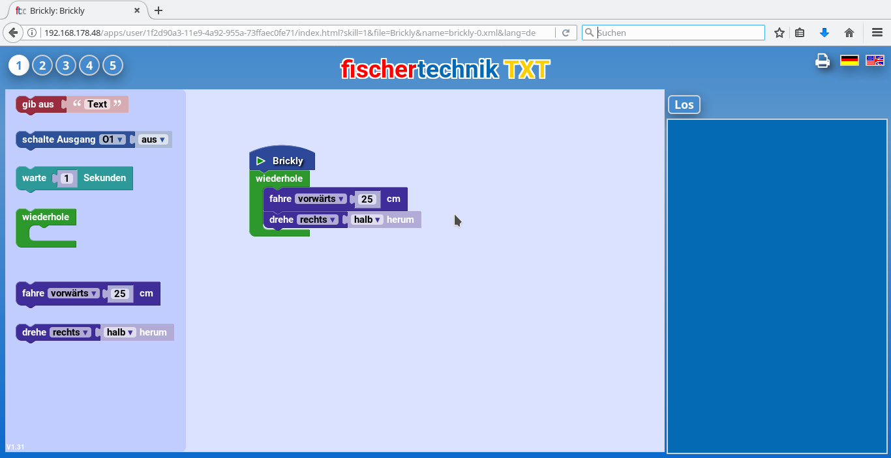
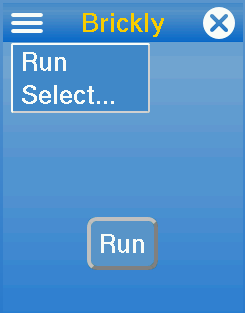

# Brickly

Brickly ist eine graphische Entwicklungsumgebung für die [Community Edition Firmware](http://cfw.ftcommunity.de/ftcommunity-TXT/de/) des Fischertechnik TXT. Sie basiert auf Google Blockly.  

# Wozu braucht man Brickly?  
Mit Brickly kannst du im Browser, z.B. auf einem Tablet oder einem PC, graphisch Programme erstellen, die auf dem TXT laufen. Der TXT dient dabei als Webserver, auf den du über WLAN zugreifen kannst. Die Programme können die Eingänge des TXT auslesen und seine Ausgänge, z.B. für Motoren ansteuern.    

Du programmierst mit Brickly, indem du im Browser mit der Maus Bausteine zu einem Programm zusammenfügst. Um dir den Einstieg zu erleichtern, stehen fünf verschiedene Erfahrungsgrade zur Verfügung. Die Programme werden auf dem TXT gespeichert, können aber auch (mit der App [BrickMCP](https://github.com/ftCommunity/ftcommunity-apps/blob/master/packages/BrickMCP.zip)) auf andere Rechner übertragen werden.  

# Installation und Start  
Zur Installation musst du den TXT mit der Community Firmware starten. Der einfachste Weg zur Installation von Brickly ist der App Store. Du startest die App "Store" auf dem Tochscreen deines TXT. Hier wählst du jetzt "Brickly" aus. Im Menü mit den drei Strichen oben rechst findest Du den Befehl "Install". Hier drückst du drauf, und Brickly wird installiert.  
Du kannst Brickly auch als [Zip-Datei](https://github.com/ftCommunity/ftcommunity-apps/blob/master/packages/brickly.zip) vom GitHub-Repository der fischertechnik community herunterladen. Auf dem Web-Interface siehst du unten einen Bereich "App Upload". Hier wählst du die heruntergeladene Brickly-Zip-Datei aus und drückst dann auf den "Upload"-Knopf. Brickly erscheint nach der Installation in der Liste der installierten Apps.  

## Start im Web-Interface  
Im Web-Interface kannst du Brickly jetzt mit diesem Symbol auswählen.  

Auf der nächsten Seite kommst du mit "Open local application pages" auf die Seite von Brickly. Damit du mit Brickly programmieren kannst, muss im Browser die Ausführung von JavaScript möglich sein. Auf der Brickly-Seite kannst Du auch die Sprache auswählen, entweder Deutsch oder Englisch (mit den Flaggen-Symbolen rechts oben in der Ecke). Außerdem kannst du dein Brickly-Programm ausdrucken: wenn du auf das Drucker-Symbol rechts oben drückst, erhälst du ein Bild von deinem Programm, das du mit der Druck-Funktion deines Browsers drucken kannst.  

## Benutzung auf dem TXT-Touch-Screen  
  
Hier siehst du, wie Brickly auf dem TXT-Touch-Screen aussieht. Programmieren kannst du nur im Browser auf deinem PC oder Tablet. Auf dem TXT kannst du ein Programm auswählen (mit "Select..."). Wenn du auf "Run" drückst, startet das Programm. Wenn du Brickly auf dem TXT beenden willst, drückst du einfach auf das X rechts oben. Wenn du Brickly auf dem TXT beendet hast und das Browserfenster noch offen ist, kannst du durch Drücken auf "Verbinde" rechts im Browser Brickly wieder starten.    

## Arbeiten mit Brickly  
In den folgenden Seiten kannst Du für jeden Erfahrungsgrad nachlesen, welche Bausteine dir zur Verfügung stehen. Grundlegende Erklärungen gibt es auf der Seite ["Anfänger"](level-1.md).  
