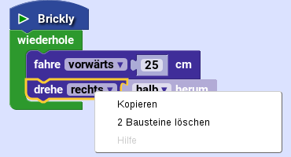

# Erster Erfahrungsgrad "Anfänger"  

Oben links auf der Startseite von Brickly siehst du fünf kleine Kreise mit Zahlen. Hier wählst du die 1 aus. Du kommst damit zu dem Erfahrungsgrad "Anfänger".  
  
  

Auf der linken Seite siehst Du einige Bausteine, aus denen du dein Programm zusammenbauen kannst. In der Mitte ist deine Arbeitsfläche. Ganz rechts siehst du einen blauen Kasten. Hier wird der Text erscheinen, der von Brickly ausgegeben wird, aber auch Fehlermeldungen, wenn etwas ganz schief laufen sollte.   

In der Arbeitsfläche siehst du schon einen ersten Baustein. Mit diesem Anfangsbaustein beginnt dein Programm. Ziehe mit der Maus einen Baustein von der linken Seite hierher. Du siehst, dass der Nippel auf der Unterseite des Anfangsbausteins gelb aufleuchtet. Jetzt kannst du deinen Baustein hier ablegen.   

Bei manchen Bausteinen kannst du etwas auswählen. Dazu drückst du auf das kleine blaue Dreieck in dem Auswahlfeld. Wenn du eine Reihe von Bausteinen untereinander zusammengefügt hast, kannst du auf "Los" (über dem blauen Kasten auf der rechten Seite) drücken. Damit wird dein Programm auf den TXT hochgeladen und dort gleich gestartet. Die Befehle auf den Bausteinen werden jetzt von oben nach unten nacheinander abgearbeitet. Der Baustein, an dem der TXT gerade arbeitet, leuchtet auf. Wenn das Programm fertig ist, werden alle Ausgänge wieder zurückgesetzt, also z.B. alle Motoren gestoppt.  

## Die Bausteine im Erfahrungsgrad "Anfänger"  
* `gib aus <Text>`Statt *Text* kannst du hier über die Tastatur an deinem Rechner einen anderen Text eingeben. Drücke dazu in das Feld und schreibe deinen Text, z.B. "Hallo TXT". Beende die Eingabe mit der Eingabetaste auf deiner Tastatur oder indem du (mit der Maus) irgendwohin drückst. Wenn das Programm läuft, erscheint der Text in dem blauen Kasten auf der rechten Seite und auf dem Touchscreen deines TXT.   

* `schalte Ausgang <O1> <aus>`: Mit diesem Baustein kannst du direkt einen Ausgang am TXT ansteuern, um z.B. eine Lampe leuchten zu lassen. Mit *ein* schaltest du den Ausgang ein, mit *aus* wieder aus. Achte darauf, den richtigen Ausgang auszuwählen, also den, an dem du auf dem TXT deine Lampe oder deinen Motor angeschlossen hast. Denk daran, dass am Programmende alle Ausgänge wieder ausgeschaltet werden und verwende einen *warte*-Baustein, wenn es nötig ist. 
* `warte <1> Sekunden`: der TXT macht 1 Sekunde lang nicht mit dem Programm weiter. Du kannst hier auch eine andere Zahl eingeben. Wähle aber keine zu lange Zeit, sonst wird dir langweilig.    

* `wiederhole`: Wenn du einen Befehl oder eine Gruppe von Befehlen nicht nur einmal, sondern immer wieder ausführen möchtest, verwendest du den *wiederhole*-Baustein. Die Befehlsbausteine schiebst du in den Bauch in dem Wiederhole-Baustein. Jetzt hast du ein Programm, das immer wieder durchläuft. 
Zum Stoppen des Programms musst du auf den "Stopp"-Knopf drücken. Du findest den "Stopp"-Knopf rechts oben über dem blauen Kasten, da, wo vorher der "Los"-Knopf war.   
* `fahre <vorwärts> <25> cm`: Damit kannst du den Fahrroboter aus dem Fischertechnik TXT Discovery Set 25 cm geradeaus vorwärts fahren lassen. Statt *vorwärts* kannst du auch *rückwärts* auswählen, und du kannst eine längere Strecke eingeben. Mehr als 47 cm sind aber nicht möglich.    
* `drehe <rechts> <halb> herum`: Damit kannst du den Fahrroboter sich auf der Stelle drehen lassen. Du kannst *rechts* oder *links* auswählen, je nachdem mit welchem Rad sich der Roboter drehen soll. *Rechts* dreht mit dem rechten Rad, so dass sich der Roboter nach links dreht. Außerdem kannst du auswählen, wie weit er sich drehen soll: *etwas* dreht um einen Achtelkreis, *halb* dreht genau zur Seite (einen Viertelkreis), *weit* noch ein Stück weiter, und bei *ganz* guckt der Roboter nach der Drehung genau in die entgegengesetzte Richtung, weil er sich um einen Halbkreis gedreht hat.    

## Kontextmenü  

Wenn du auf die rechte Maustaste drückst, öffnet sich ein Kontextmenü. Wenn du auf einen Baustein drückst, hast du folgende drei Punkte zur Auswahl:    
* "Kopieren": damit kannst du den ausgewählten Baustein kopieren und die Kopie woanders einbauen.
* "Bausteine löschen": Wenn du den Baustein nicht mehr brauchst, kannst du ihn von deiner Arbeitsfläche entfernen. Keine Angst: auf der linken Seite gibt es ihn noch, so dass du ihn dir wiederholen kannst.    
* "Hilfe": bringt dich zu einer Webseite, die dir weitere Informationen zu dem Baustein liefert.    
     
Wenn du auf die leere Arbeitsfläche drückst, enthält das Kontextmenü folgende Punkte:
* "Rückgängig": macht die letzte Aktion rückgängig.
* "Wiederholen": wiederholt eine rückgängig gemachte Aktion, macht also rückgängig rückgängig.

