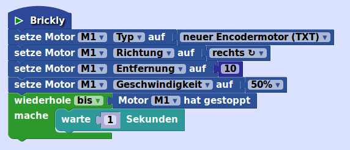
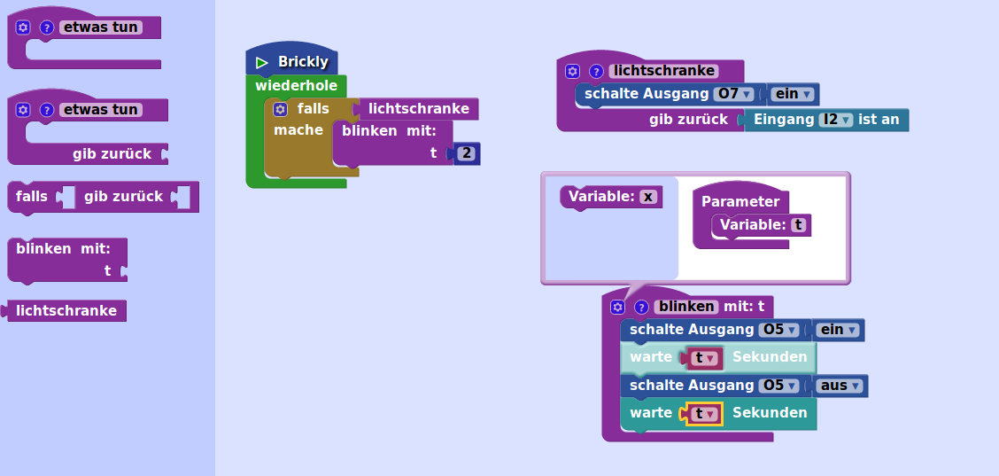

# Vierter Erfahrungsgrad "Senior"    

In diesem Erfahrungsgrad gibt es viele neue Bausteine für die Nutzung von Encoder-Motoren. Alle Motorbausteine findest du jetzt in einer eigenen Untergruppe "Motoren" unterhalb von "Ausgänge".    
Außerdem kannst du jetzt eine Gruppe von Befehlen zu einer Funktion zusammenbauen. Damit wird ein langes Programm viel übersichtlicher.    

## "Ausgänge" - "Motoren"    

    
* `setze Motor <M1> <Geschwindigkeit> auf`: mit diesem Baustein kannst du den ausgewählten Motor  (M1, M2, M3 oder M4) genau ansteuern. Je nach ausgewählter Eigenschaft (*Geschwindigkeit*, *Richtung*, *Entfernung*, *Typ*) musst du noch einen der folgenden drei Bausteine anbauen. Für die *Entfernung* baust du noch einen Zahlenbaustein an. Die *Geschwindigkeit* musst du für jeden Motor auf jeden Fall angeben, sonst bewegt er sich nicht. Der *Geschwindigkeit*-Baustein startet den Motor. **Wichtig**: Wenn der Motor gestartet ist, läuft das Programm weiter. Wenn es am Ende angekommen ist, werden alle Motoren ausgeschaltet. Es kann daher sein, dass der Motor anhält, bevor er die angegebene Entfernung zurückgelegt hat. Du musst also deinem Motor Zeit geben, wenn er eine bestimmte Entfernung zurücklegen soll, z.B. in dem du einen `warte`-Baustein einbaust.  
* `<links>`: gibt die *Richtung* an, in die sich der Motor drehen soll (*rechts* oder *links*).  
* `<neuer Encodermotor (TXT)>`: entweder *neuer Encodermotor* oder *alter Encodermotor*. Der Typ des Encodermotors ist wichtig, wenn du die Entfernung angibst. Die beiden Motoren unterscheiden sich nämlich in der Anzahl der Impulse pro Umdrehung der Antriebswelle. Wenn du den *Typ* deines Motors richtig setzt, wird dieser Unterschied berücksichtigt.  
* `<100% (ein)`: gibt die *Geschwindigkeit* an.  
* `stoppe Motor <M1>`: stoppt den ausgewählten Motor.  
* `Motor <M1> hat gestoppt`: dieser Bedingungsbaustein wird wahr, wenn der Motor angehalten hat, weil die angegebene Entfernung erreicht wurde. Das funktioniert nur bei einem Encodermotor, wenn die Entfernung angegeben ist.  
* `kopple Motoren <M1> und <M2>`: zwei gekoppelte Motoren laufen gleichzeitig und mit gleicher Geschwindigkeit. Damit beide Motoren wirklich synchron laufen und auch zur gleichen Zeit ein Stopp-Signal geben, solltest Du bei beiden Motoren die gleiche Entfernung einstellen. Die Motoren können aber in unterschiedliche Richtung drehen: dann dreht sich der Fahrroboter.  
* `fahre <vorwärts> <25> cm`: wie [hier](level-1.md#fahre)  
* `fahre <vorwärts> <solange>`: wie [hier](level-2.md#fahresolange)  
* `drehe <rechts> <90>`: wie [hier](level-3.md#drehegrad)    

## Neu in "Schleifen"       
* `<die Schleife abbrechen>`: mit diesem Baustein kannst du den Durchlauf durch eine Schleife abbrechen. Das Programm springt dann sofort zu dem ersten Baustein nach der Schleife. Du kannst diesen Baustein nach einer Bedingung in einer Schleife einbauen, um z.B. in einer Zählschleife im Notfall abzubrechen. Du kannst auch auswählen *sofort mit dem nächsten Schleifendurchlauf fortfahren*, wenn in einer Schleife einige Befehle unter bestimmten Bedingungen nicht ausgeführt werden sollen. **Wichtig**: beide Bausteine funktionieren nicht bei der "Wiederhole"-Schleife (die ohne "solange", "bis" oder "10 mal"). Die ist eine Endlosschleife, die nur mit einem Drücken auf "Stopp" abgebrochen werden kann.    

## Neu in "Mathe"       
* `<Quadratwurzel>` berechnet die ausgewählte mathematische Funktion (*Quadratwurzel*, *Betrag*, *-*, *ln*, *log10*, *e^* oder *10^*) aus dem angebauten Zahlenbaustein.    
* `Rest von <> ÷ <>`: berechnet den Rest der Division der 1. Zahl durch die 2. Zahl (Modulo-Funktion). Ein Beispiel: Bei einer geraden Zahl ist der Rest der Division durch 2 gleich 0. Damit kannst du in einer Schleife einen Befehl nur in jedem zweiten Durchlauf ausführen.    

## Neu in "Text"    
* `an <etwas> Text anhängen`: hängt an die Variable *etwas* oder eine andere ausgewählte Variable den Inhalt des angehängten Textbausteines an.     

## "Funktionen"    

    
* `etwas tun`: Damit definierst du deine Funktion. Du legst den Baustein einfach auf der Arbeitsfläche ab. In den Bauch baust du die Befehlsbausteine, die deine Funktion ausführen soll. Statt *etwas tun* solltest du der Funktion einen sinnvollen Namen geben. Du kannst zusätzlich noch einen Text schreiben, der die Funktion beschreibt, wenn du auf das kleine Fragezeichen neben dem Namen drückst. Wenn du den Funktionsbaustein auf der Arbeitsfläche abgelegt hast, findest du in dieser Gruppe auch einen Baustein mit dem Namen deiner Funktion. Das ist der Funktionsaufruf. Diesen Baustein baust du in dein Programm ein. Damit wird deine Funktion aufgerufen, d.h. die Befehle im Bauch des Funktionsbausteins werden ausgeführt. Du kannst der Funktion auch einen oder mehrere Parameter hinzufügen. Das ist ein Wert, den das Programm der Funktion beim Aufruf übergibt und den du innerhalb der Funktion nutzen kannst. Dazu drückst du auf das kleine Zahnrad links oben in dem Funktionsbaustein und ziehst dann den Baustein *Variable* in den Bauch des Funktionsbausteins auf der rechten Seite des Kastens. Gib auch den Parametern sinnvolle Namen! Beim Aufruf musst du dann einen passenden Wertbaustein an den Aufruf anbauen.    
* `etwas tun: gib zurück:` Diese Funktion kann nicht nur einfach Befehle ausführen, sondern auch einen Wert zurückgeben (z.B. den Messwert eines Sensors). Den Funktionsbaustein verwendest du dann beim Aufruf wie einen Wertbaustein. Auch dieser Funktion kannst du Parameter hinzufügen.  
* `falls: gib zurück:`: Dieser Block darf nur innerhalb eines Funktionsblocks genutzt werden. Nach *falls* kommt eine Bedingung. Wenn diese Bedingung *wahr* ist, beendet sich die Funktion sofort und gibt den angegebenen Wert zurück. Damit kannst du z.B. eine Fehlermeldung zurückgeben, wenn etwas schief gelaufen ist.    

