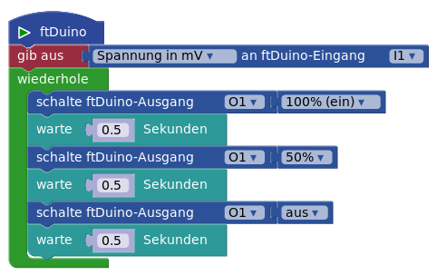
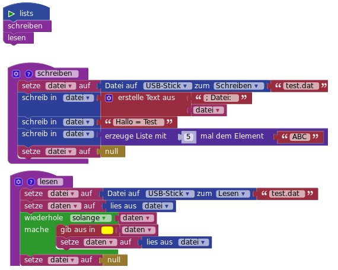
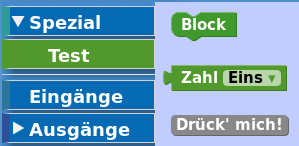

# Brickly-Plugins

Plugins erweitern die Funktionalität von Brickly durch neue Blöcke und neue Funktionen. Die Infrastruktur für Plugins ist noch in der Entwicklung und kann sich ändern.

## Installation

Über das Webinterface von Brickly kannst du im Erfahrungsgrad 5 (Experte) Plugins installieren, indem du auf das "Stecker"-Symbol drückst.

Zur Installation eines Plugins, muss der TXT verbunden sein. Wenn du bei der Installation eine Fehlermeldung erhälst, drücke auf den "Verbinde"-Button.

*Tip:* Um die Plugin-Dateien aus dem [Repository](https://github.com/harbaum/brickly-plugins) herunterzuladen, musst du zuerst die XML-Datei dort auswählen, dann kannst du durch einen rechten Mausclick auf "Raw" die Datei herunterladen und am gewünschten Ziel speichern.

## Die Plugins

### ftDuino IO - ftduino.xml

Über dieses Plugin hat Brickly Zugriff auf die Ein- und Ausgänge eines [ftDuino](http://ftduino.de), der über USB mit dem TXT oder einen [TX-PI](https://github.com/harbaum/tx-pi) verbunden ist..

Brickly kommuniziert über ftduino_direct mit dem ftDuino. Auf dem ftduino muss der daher Sketch [ftduino_direct](https://github.com/PeterDHabermehl/ftduino_direct) laufen. Das heißt, dass du (z.B. mit der App "ftDuinIO") zunächst mal das ftduino_direct-Binary auf den ftDuino flashen musst. 

### file IO - fileio.xml

Dieses Plugin liefert Blöcke zum Lesen und Schreiben von einfachen Files auf einem USB-Stick oder auf der SD-Karte. Du findest sie in der Kategorie "Spezial",

### test - test.xml

Dieses Plugin macht gar nichts besonderes. Es demonstriert einige einfache Konzepte, z.B. die Implementation einer eigenen Unterkategorie und einen Button, der direkt mit dem TXT kommuniziert.

